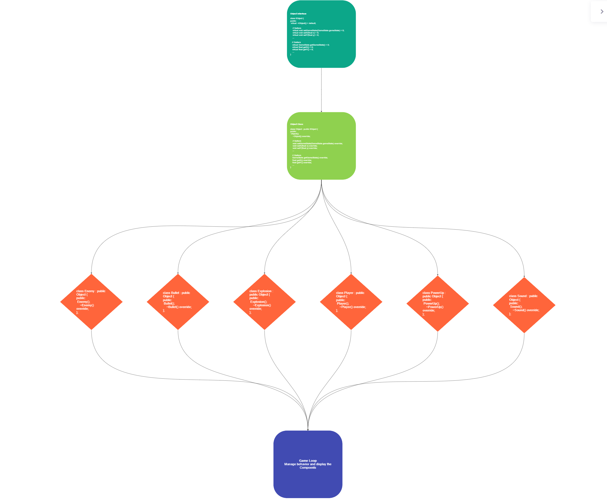

# 👾 R-Type

## 📝 Description
R-Type is a game where you have to destroy all the enemies that are coming to you. You can shoot with your spaceship, and you can also use special weapons. You can play with friends in a multiplayer mode.

## 📖 Documentation
You can see our documentation in the documentation folder. Use vscode to open a better view, on a live server.

<br/>

## ⚙️ Installation
First, you need to clone the repo, and its git submodules:
```sh
git clone https://github.com/EpitechPromo2025/B-CPP-500-LIL-5-2-rtype-william.mallevays.git --recurse-submodules
```

<br/>

### - Windows :
1. Run Visual Studio as administrator
2. Then you'll have to right click on "CMakeList.txt" located in the solution explorer
3. Click on "Configure cache"
4. Now click on "x64-Debug" at the top of your screen, and select "Manage configurations..."
5. Then click on the "+" sign, and select "x64-Release" and save (ctrl + s)
6. Once it is done you just have to click on "Select startup item" on the top of the screen
7. And select "r-type_client.exe" or "r-type_server.exe" to compile and launch the client or the server

<br/>


### - Linux :
```sh
mkdir build && cd build
```
```sh
cmake ..
```
```sh
make
```

Launch the R-Type client:
```sh
./r-type_client
```

Launch the R-Type server:
```sh
./r-type_server
```

<br/>


## 💻 How to play
### Rules
The rules are simple, you have to destroy all the enemies that are coming to you. You can shoot with your spaceship, and you can also use special weapons. You can play with friends in a multiplayer mode.

### ⌨️ Keys
- `Arrows`: Up, Down, Left, Right
- `Space`: Simple shoot
- `X`: Laser shoot
- `C`: Rocket shoot

### 🎮 Controller (DualShock 4 taken as an example)
- `Left joystick`: Up, Down, Left, Right
- `Cross`: Simple shoot
- `Circle`: Laser shoot
- `Triangle`: Rocket shoot

[//]: # (Technical documentation)
## 📚 Technical documentation
### 📦 Dependencies
- [SFML](https://www.sfml-dev.org/)
- [Boost](https://www.boost.org/)
- [CMake](https://cmake.org/)

### 📁 Folder structure
- `assets`: Contains all the assets of the game
- `client`: Contains all the client files
- `server`: Contains all the server files
- `network`: Contains all the files for objects serialization and deserialization
- `documentation`: Contains all the documentation files
- `CMakeLists.txt`: CMake file

### The game Engine
#### Class diagram
[//]: # (![Class diagram]&#40;./ClassDiagram.pdf&#41;)


#### Add an entity

- Declare the entity in the `networks/objects` folder
- Inherit it from `Objects` like the example below:
```cpp
    namespace Network {
        class Bullet : public Object {
        public:
            Bullet();
            ~Bullet() override;
        };
}
```
- Include your Entity in Deserialization.hpp
```cpp
    #include "YourObject.hpp"
```
- Declare your entity and a function to update it in Game.hpp, example:
```cpp
void UpdateExplosion(const std::shared_ptr<sf::RenderWindow> & window, Network::Object & explosion);
```
- Set its assets in Game.cpp, example:
```cpp
    std::map<ExplosionType, sf::Sprite> _explosion;
    std::map<ExplosionType ,std::shared_ptr<sf::Texture>> _explosionTexture;
    std::map<ExplosionType ,sf::IntRect> _explosionRect;
    int _explosionTmp;
```
- Initialize the entity in the `Client/src/GameStatus/Game.cpp` file and define its behavior
```cpp
// Explosion assets initialization example
    _explosionRect[ExplosionType::MISSILE] = {0, 0, 16, 14};
    _explosionRect[ExplosionType::SMALL] = {0, 0, 32, 30};
    _explosionRect[ExplosionType::MEDIUM] = {0, 0, 32, 32};
```

## 👥 Contributors
- [Antoine Podvin](https://github.com/antoinepod)
- [Antoine Paul](https://github.com/PAn-27)
- [Marine Poteau](https://github.com/mpoteau)
- [William Mallevays](https://github.com/2oubleV)
