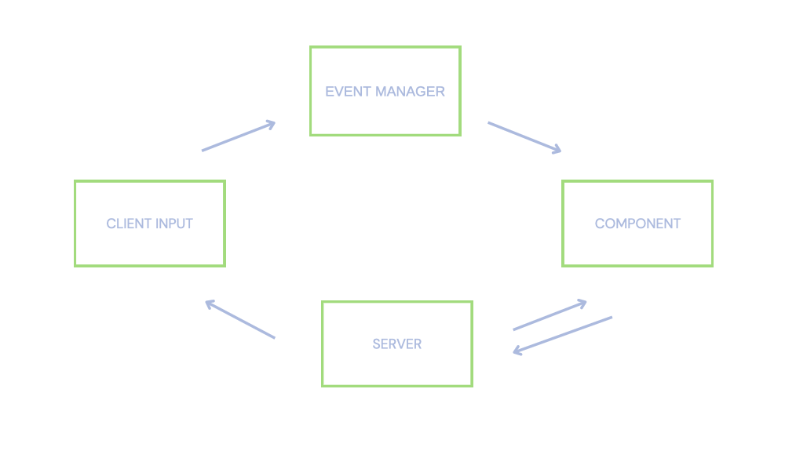
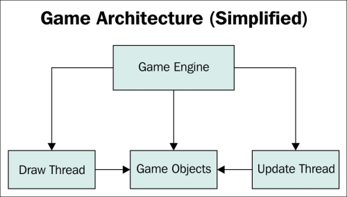

# R-Type

**The goal of this project :**


The objective of the project is to develop a game that is fun to play and that makes the most of network protocols in order to give the player a competitive spirit.

It is frequent that games are victims of lag, and this is sometimes related to the problem of implementation of the network part. Through an optimized ECS and the speed of the UDP protocol, the R-type aims to revolutionize gaming in the world.

# Game

This game is informally called a Horizontal Shmup (e.g. Shoot’em’up), and while R-Type is not the first one of its category, this one has been a huge success amongst gamers in the 90’s, and had several ports, spin-offs, and 3D remakes on modern systems.

As you now understand, we have to make our own version of R-Type.

# Interactions

We can play with a keyboard.

# Architecture



The client communicate with the server in UDP, and play the game.

# Server

The server must be :

- multi-threaded
- able to handle more than one game at a time
- able to handle multiple games in a row
- the referee of all games it manages

# Client


The client must contain anything necessary to display the game and handle player input. 

> The client is the display terminal of the game

# Libraries

- **SFML** : The library used to display.

- **Boost** : The library used to manage communication, threads and processes.

# Game Engine



The game engine is the core foundation of any video game: it determines how you represent an object in-game, how the coordinate system works, and how the various systems of your game (graphics, physics, network... ) communicate.

# Compilation

It is a cross-platform built system:

- **Linux**: it must generate a `Makefile` to be able to build the project

```
mkdir build && cd build
cmake .. -G "Unix Makefiles"
cmake --build .
./r-type
```

- **Windows**: it must generate a Visual Studio solution `.sln` (will be tested with Visual Studio 2022)

```
mkdir build && cd build
cmake .. -G "Visual Studio 17"
cmake --build .
r-type.exe
```

